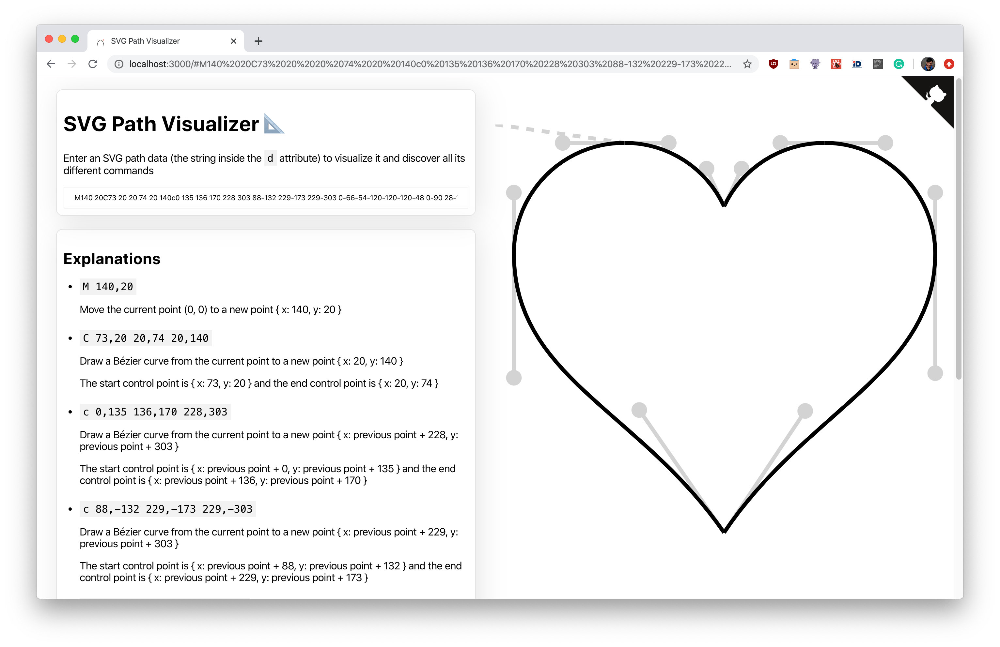

# SVG Path Visualizer 📐

→ **[SVG Path Visualizer 📐](https://svg-path-visualizer.netlify.app)**

I've been working with SVGs for some time and always struggled to understand the path data syntax so I figured I'd build a visualizer for it.

Enter an SVG path data (the string inside the `d` attribute) to visualize it and discover all its different commands.



## Contributing

I believe there is a lot of potential to explain more concept (Bezier curve, control points, etc.). I'd be happy to accept PRs!

## Project setup

```bash
yarn
```

### Compiles and hot-reloads for development

```bash
yarn start
```

### Compiles and minifies for production

```bash
yarn build
```

### Run your tests

```bash
yarn test
```
